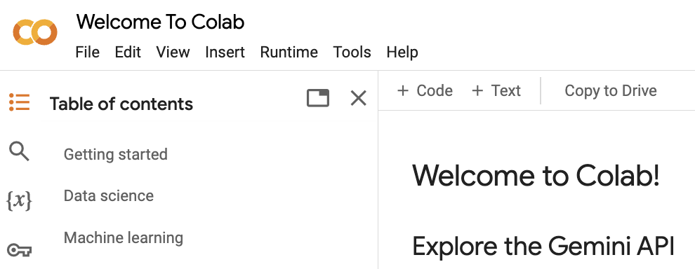

# Google Colab basics

> What is Google Colab?
>
> Why Google Colab for data analysis and ML?
>
> How to start using Google Colab?

### What is Google Colab

<figure><figcaption><p>Google Colab</p></figcaption></figure>

<mark style="color:purple;">**Google Colab**</mark>, short for Google Collaboratory, is a free, cloud-based service provided by Google that allows users to write and execute <mark style="color:purple;">Python code</mark> directly in a web browser.&#x20;

It offers a powerful and flexible environment for machine learning, data analysis, and scientific research, leveraging the capabilities of <mark style="color:purple;">Jupyter Notebooks</mark>.&#x20;


Jupyter Notebooks are interactive web-based documents that combine live code, equations, visualizations, and narrative text.


### Why Google Colab/Jupyter Notebooks for data analysis and ML?

*   **No Setup Required**

    Colab is a cloud-based service, meaning you don't need to install or configure any software. You can start coding immediately in a <mark style="background-color:purple;">pre-configured</mark> environment with popular libraries already installed.

This also contributes to **easy sharing and publishing** your work

Notebooks can be easily shared via a link or integrated into platforms like GitHub, making it simple to share your work with the community or collaborators.

* **Free access to **<mark style="color:purple;">**GPUs**</mark>** and **<mark style="color:purple;">**TPUs**</mark>

One of Google Colab key features is the availability of free access to <mark style="color:purple;">GPUs</mark> and <mark style="color:purple;">TPUs,</mark> making it an excellent tool for training deep learning models. By providing free access to these powerful resources, Google Colab allows users to significantly speed up the training and execution of their machine learning models and other compute-intensive tasks without needing to invest in expensive hardware. This makes advanced computational resources accessible to a broader audience, from students and researchers to developers and data scientists.


GPUs (Graphics Processing Units)&#x20;

TPUs (Tensor Processing Units)

GPUs and TPUs are specialized hardware accelerators designed to handle the heavy computational demands of tasks like deep learning, large-scale data processing, and complex mathematical computations.&#x20;


* **Integration with **<mark style="color:purple;">**Google Drive**</mark>** for easy access to files**

Google Colab supports seamless integration with Google Drive, enabling easy access to <mark style="background-color:purple;">data</mark> and the ability to save and share <mark style="background-color:purple;">notebooks</mark> effortlessly. With a user-friendly interface and support for numerous <mark style="background-color:purple;">pre-installed libraries</mark>, Google Colab has become a popular choice among researchers, educators, and developers for prototyping and collaborative work.

Additionally, Google Colab Pro and Pro+ options provide even more resources, including longer runtimes, more powerful GPUs, and more memory, enabling the handling of larger datasets and models.

* **Interactive widgets and visualization**

Supports interactive widgets and advanced visualization libraries (e.g., Matplotlib, Plotly), allowing for dynamic visualizations and interactive model analysis. Great tutorial [here](https://ipywidgets.readthedocs.io/en/latest/examples/Widget%20Basics.html)

[See this short demo](https://colab.research.google.com/drive/1sJMYCxu43Pr3jBCj0\_Ud1KcCNFlW46o6?usp=sharing) - that you can build today in approx 10 min&#x20;

* **Extensive Library Support:**

Colab supports popular frameworks such as <mark style="color:purple;">TensorFlow, PyTorch, and Keras</mark>, which are commonly used for developing and fine-tuning LLMs. It comes with pre-installed libraries like <mark style="color:purple;">PyTorch, TensorFlow, Hugging Face Transformers</mark>, and more, which are essential for developing and fine-tuning LLMs.

***

### How to start using Google Colab and Jupyter Notebooks?

To start, you need the following:

1. **Google Account**: You need a Google account to access Google Colab.
2. **Web Browser**: A modern web browser like Google Chrome, Firefox, Safari, or Edge.

and that is it!

***

A Colab notebook is composed of cells, which can contain&#x20;

* code,&#x20;
* text, images, and more.&#x20;

You can execute code within these cells using the **Shift-Enter** shortcut or the Play button. The outputs are not limited to simple text; they can include dynamic, rich outputs such as data visualizations. For instance, Colab supports several third-party visualization libraries like Altair.

Colab notebooks can be shared just like a Google Doc, and text cells can be used to add context to the code you're writing. These text cells are formatted using **Markdown**, a simple and powerful format that allows for headings, paragraphs, lists, and even mathematical formulas.

#### Markdown editing basics

{% embed url="https://githubtocolab.com/maria-pro/hf/blob/main/activities/Activity%201_Markdown_Guide.ipynb" %}
Markdown basics


***

### **Google Colab/**Jupyter notebooks/Python **tutorial**


{% embed url="https://colab.research.google.com/github/maria-pro/hf/blob/main/activities/Activity%201.%20Google%20Colab%20and%20Python%20basics.ipynb#scrollTo=BRoN8RvJqJwN" %}

#### **1. Getting Started**&#x20;

**Task 1: Open a New Notebook**

* Go to [Google Colab](https://colab.research.google.com/).
* Click on **File** > **New notebook**.
* A new Jupyter notebook will open in a new tab.

**Task 2: Rename Your Notebook**

* Click on the notebook title at the top (which might be something like "Untitled0").
* Rename it to something descriptive, like "MyFirstColabNotebook".

#### **2. Basic Operations in Colab**

**Task 3: Running Python Code**

*   In the first cell of your notebook, type a simple Python command, like:

    ```python
    print("Hello, Google Colab!")
    ```
* Press **Shift + Enter** or click the **Run** button to execute the cell.

**Task 4: Working with Markdown**

* Add a new cell by clicking the **+ Code** button or **+ Text** button.
* Switch the cell type to Markdown by selecting **Text** from the dropdown at the top of the cell.
*   Type some Markdown to format text, for example:

    ```markdown
    # This is a Heading
    ## This is a Subheading
    **Bold Text** and _Italic Text_.
    ```
* Run the cell to see the formatted output.

#### **3. Working with Data in Colab**

**Task 5: Uploading Files from Your Local Machine**

*   Use the following code to upload a file from your local machine to Colab:

    ```python
    from google.colab import files
    uploaded = files.upload()
    ```
* Run the cell, and you'll be prompted to select a file from your computer.

**Task 6: Reading Data from Google Drive**

*   First, mount your Google Drive:

    ```python
    from google.colab import drive
    drive.mount('/content/drive')
    ```
*   Navigate to your files in Google Drive using:

    ```python
    !ls "/content/drive/My Drive"
    ```
*   Read a CSV file from Google Drive:

    ```python
    import pandas as pd
    df = pd.read_csv('/content/drive/My Drive/your-file.csv')
    df.head()
    ```

#### **4. Using GPU and TPU in Colab**

**Task 7: Checking for GPU Availability**

*   To see if a GPU is available:

    ```python
    import torch
    print(torch.cuda.is_available())
    ```
* If True, then a GPU is available for use.

**Task 8: Switching to a GPU/TPU Runtime**

* Go to **Runtime** > **Change runtime type**.
* In the popup, set **Hardware accelerator** to **GPU** or **TPU**.
* Click **Save** and run a cell to see the effects.

#### **5. Installing and Using Libraries**

**Task 9: Installing Python Packages**

*   Install any Python package using `pip`:

    ```python
    !pip install numpy
    ```
*   Import and use the installed package:

    ```python
    import numpy as np
    print(np.random.rand(3, 3))
    ```

#### **6. Saving and Sharing Your Work**

**Task 10: Saving Your Notebook**

* To save your notebook, simply click **File** > **Save** or **Save a copy in Drive** to save it to your Google Drive.

**Task 11: Sharing Your Notebook**

* To share your notebook with others, click the **Share** button in the upper right corner.
* Adjust the sharing settings to allow others to view or edit.

**Task 12: Downloading Your Notebook**

* You can download your notebook by going to **File** > **Download** and selecting a format (e.g., `.ipynb` or `.py`).

####

**Magic Commands in Jupyter**

* Use Jupyter magic commands for common tasks. For example:
  *   `%timeit` to measure execution time:

      ```python
      %timeit sum(range(1000))
      ```
  *   `%matplotlib inline` to display plots inline:

      ```python
      %matplotlib inline
      import matplotlib.pyplot as plt
      plt.plot([1, 2, 3, 4])
      plt.show()
      ```

***

